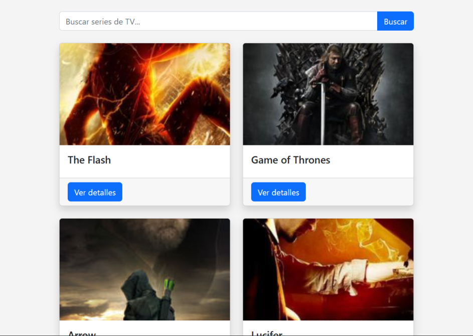

# Prueba Técnica React Developer

## Tabla de Contenidos

- [Prueba Técnica React Developer](#prueba-técnica-react-developer)
  - [Tabla de Contenidos](#tabla-de-contenidos)
  - [Preview](#preview)
    - [Screenshot](#screenshot)
  - [Proyecto](#proyecto)
  - [Proceso](#proceso)
    - [Construido con:](#construido-con)

## Preview

### Screenshot

## Proyecto

Este proyecto fue realizado con el fin de presentar una Prueba Técnica para el puesto de React Developer.

## Proceso

### Construido con:

- Vite
- React
- React icons
- Axios
- Diseño Responsivo
- Bootstrap

